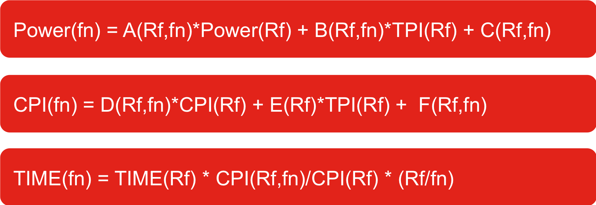

EAR Library 
------------------
The EAR library is the core of the EAR package. The EARL offers a ligthweigth and simple solution to select the optional frequency for MPI applications at runtime.

EARL is dynamically loaded with applications using the PMPI interface used by many other runtime solutions. The current EARL version only supports with this mechanism but it is under development an API to be inserted in the OpenMPI library.

At runtime, EARL goes trough the following phase:


1. Automatic detection of application outer loops. This is done by dynamically intercepting MPI calls (using LD_PRELOAD) and invoking DynAIS algorithm, our Dynamic Application Iterative Structure detector algorithm. DynAIS is highly optimized for new Intel architectures reporting low overhead.

2. Computation of the application signature. Once DynAIS starts reporting iterations for the outer loop, EAR starts computing the application signature. This signature includes: CPI, iteration time, DC node power and TPI (transactions per instruction). Since DC node power measurements error highly depends on the hardware, EAR automatically detects the hardware characteristics and sets a minimum time to compute the signature in order to minimize the average error.



3. Power and performance projection. EAR has its own performance and power models which uses, as an input, the application signature and the system signature. The system signature is a set of coefficients characterizing each node in the system. They are computed at the learning phase at the EAR configuration time. EAR projects the power used and computing time (performance) of the running application for all the available frequencies in the system.


4. Apply the selected power policy. EAR includes two power policies to be selected at runtime: 'minimize time to solution' and 'minimize energy to solution'. These policies are permitted or not by the system administrator. At this point, EAR executes the power policy, using the projections computed in the previous phase, and selects the optimal frequency for this application and this particular run.


Configuration
-------------
The EAR Library  is based on ear.conf settings when executing in a fully installed environment. Specific settings are available through a shared memory regions initialized by EARD and readable by the EARL. Fields described in ear.conf affecting the EARL configuration are (lines starting with #are comments):

```
# Number of levels used by the multi-level DynAIS algorihtm
DynAISLevels=4

# Windows size for DynAIS algorithm
DynAISWindowSize=500

# Maximum time (in seconds) EAR will wait until a signature is computed. After DynaisTimeout seconds, if no signature is computed, EAR will go to periodic mode
DynaisTimeout=30

# When EAR goes to periodic mode, it will compute the Application signature every "LibraryPeriod" seconds
LibraryPeriod=30

# EAR will check every N mpi calls whether it must go to periodic mode or not
CheckEARModeEvery=1000

# Default policy
DefaultPowerPolicy=MIN_TIME_TO_SOLUTION

# List of supported policies for normal users: it must be a subset of MONITORING_ONLY,MIN_TIME_TO_SOLUTION,MIN_ENERGY_TO_SOLUTION
SupportedPolicies=MONITORING_ONLY,MIN_TIME_TO_SOLUTION,MIN_ENERGY_TO_SOLUTION

# Pstates must be specified in the following order:MIN_ENERGY_TO_SOLUTION,MIN_TIME_TO_SOLUTION,MONITORING_ONLY 
DefaultPstates=1,4,4

# Thresholds used by MIN_TIME_TO_SOLUTION and MIN_ENERGY_TO_SOLUTION policies
MinEfficiencyGain=0.7
MaxPerformancePenalty=0.1

# Time (expressed in usecs ) used between two energy measurements 
MinTimePerformanceAccuracy=10000000
```

- When executed in a partially installed system for testing, it can be configured through environment variables, however this mechanism is not recommened.

How to run MPI applications with EARL
-------------------------------------

To load EARL with MPI jobs, it is only required to set the LD_PRELOAD environment variable with the EAR library binary 'libear.so' path name, before your application starts. EARL will be loaded at runtime and MPI calls will be intercepted calling EAR API automatically. To simplify the execution of applications with EARL, we include a SLURM plugin, which extends srun options.

EAR SLURM
-------------------------
Just call the `srun` program with, at least, the argument `--ear`, which loads the EAR library together with your application using just the default configuration. For a complete list of parameters, please visit the [SLURM plugin page](https://github.com/BarcelonaSupercomputingCenter/EAR/tree/development/ear_slurm_plugin).

In example: `./srun -N2 -n2 --ear-policy=MIN_ENERGY_TO_SOLUTION --ear-policy-th=0.9 application`

If your application is not an MPI application, the benefits of the EAR library won't be applied. But the SLURM plugin would contact with the daemons in order to monitorize the application metrics and take a decision in case the energy budget is surpassed.

Launching applications calling MPI directly
-------------------------------------------
This way doesn't make use of any cluster job scheduler, so a a script is provided to make it easy that task. You can launch the script with empty parameters to view it's usage.

In the folder `$(ETC)/scripts/launching`, execute the `mpi_exec.sh` script to launch the job. In example `./mpi_exec.sh computing_node1 28 28 MONITORING_ONLY`, where both numbers are the MPI processes and the MPI's per node, an the last one is the policy. This is script will use the `LD_PRELOAD` environment variable to load the library next to your MPI applications.

Offline
-------

License
-------
All the files in the EAR framework are under the LGPLv2.1 license. See the [COPYING](../../COPYING) file in the EAR root directory.